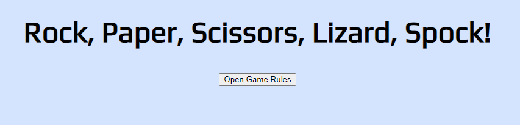
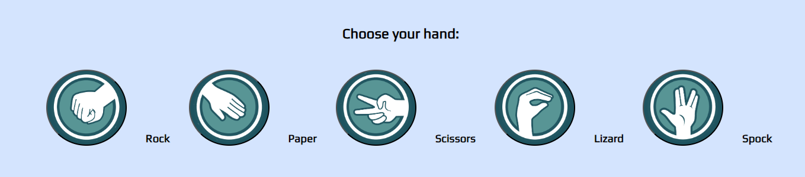
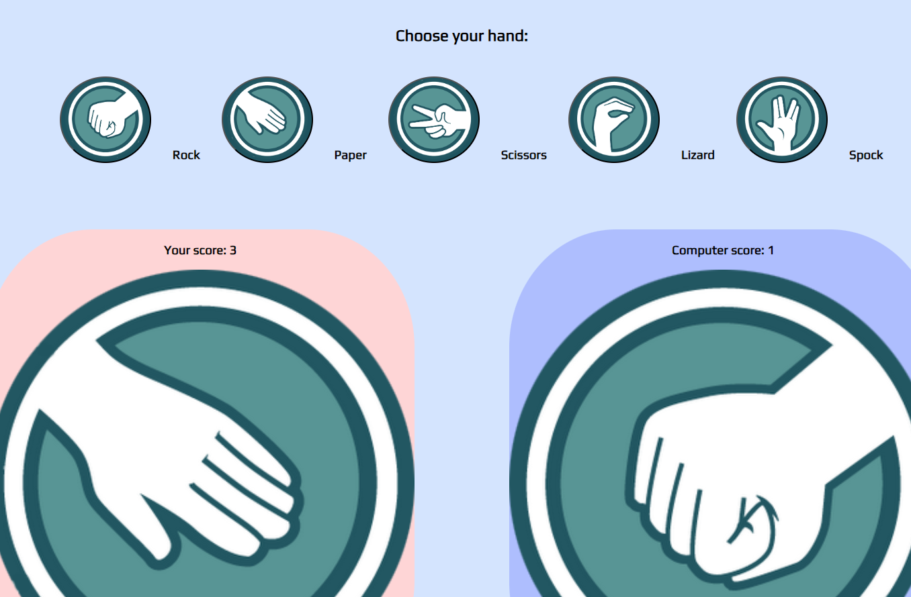
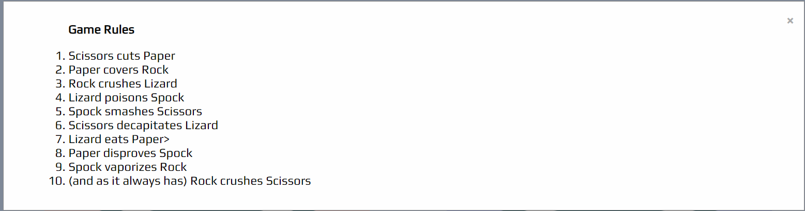
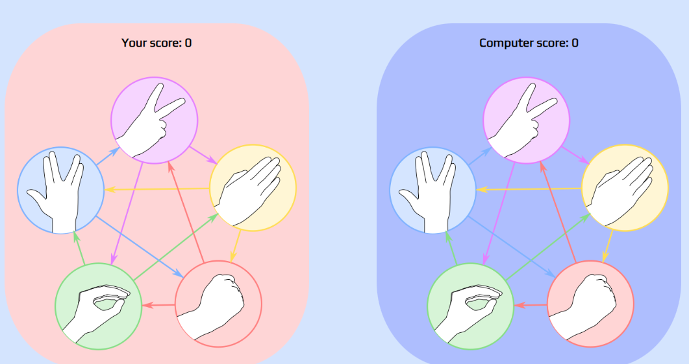

# Rock, Paper, Scissors, Lizard, Spock!

It is the classing "Rock, Paper, Scissors" game but with the Big Bang Theory additions, "Lizard and Spock". As the player, you would be able to choose your option and the computer would randomly choose its own hand. The scores are also automatically updated in order to keep track of who is ahead.

# Features

- Header
    - Covers the top of the page with the title: "Rock, Paper, Scissors, Lizard, Spock!" in a simple font which is also clearly visible in terms of contrast.
    - The title should be self-explanatory but I have included the game rules in the header in the form of a modal addition so as to avoid taking space on the page.

        

- The Game Options
    - Include a clear instruction for players to choose their hand from the interactive buttons.
    - The buttons have been layered with an image of each option along with it writen-form right next to each button.

        

- The Game Results
    - When the user clicks an option, the image relating to their choice is displayed on their side of the game board
    - The Javascript code chooses a random otpion for the Computer player, displays the image relating to the computer's choice, and then determines who the winner is.
    - The winner is announced to the user under the option's button, and the score is updated for either the user or the computer, depending on who won.
    - The results and score are clear to the user, which allows for good keeping track of the who is ahead.

        

- The Footer
    - I decided not to include a footer as I provided the rules in the header and they are accessible at any time by click on the (i) button to open the rules box.

     

# Testing

- I tested playing this game in the following browser: Chrome, Edge (TBC)
- The game results are corret but I still need to fix the images displayed for the computer choice.
- I confirmed that all writing is clear and well in contrast with the background to make it readable.
- The colour pallet and fonts chosen are carefully picked to be playful but also easy on the eyes with more pastel tones. The colour pallet for the entire page is also directly derived from the original image that you see before the player and computer choice fields are populated.

    

## Lighthouse test pending

## Bugs
- Unsolved yet
    - struggled to get the correct image to appear for the computer's choice

# Validator Testing
- HTML
    - No error were returned when passing through the official W3C validator
    
- CSS
    - Still pending
-Javascript
    - Still pending

## Deployment
- The site will be deployed to GitHub pages but that is still pending.

## Credits
---
### Content
- Code was taken and inspired from the [Love Running](https://github.com/otherworldly94b/love-running) project for a lot of this current project.
- The biggest similarities should be in social media links, the "times" section and the Gallery page.
- The signup page should also have similarities but the code for it was written by me in the Love Running project as well.
- Some CSS code was also inspired from the [Love Running](https://github.com/otherworldly94b/love-running) project.
- Great deal of help from my mentor in checking and correcting my code.
- W3S code was also used throughout the project

### Media
- All images were taken from the web and links to their origin  will be provided below.
    - [Logo](https://bigbangtheory.fandom.com/wiki/Rock,_Paper,_Scissors,_Lizard,_Spock)
    - rock, paper, scissors, lizard, spock icons (https://cse.google.com/cse?cx=4796b5020fbeaf2e6&q=rock%20paper%20scissors%20lizard%20spock&oq=rock%20paper%20scissors%20lizard%20spock&gs_l=partner-web.3...13251.22775.0.23508.0.0.0.0.0.0.0.0..0.0.csems%2Cnrl%3D10...0....1.34.partner-web..0.0.0.) from the Free ICONS Library (https://icon-library.com/icon/rock-paper-scissors-icon-29.html)