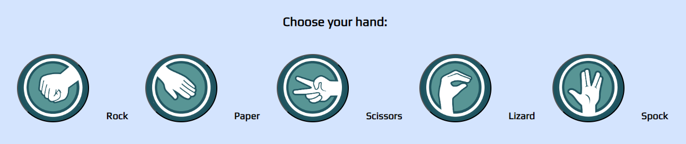
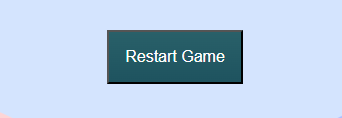
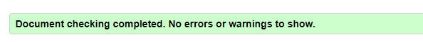

# Rock, Paper, Scissors, Lizard, Spock!

It is the classic "Rock, Paper, Scissors" game but with the Big Bang Theory additions, "Lizard and Spock". As the player, you would be able to choose your option and the computer would randomly choose its own hand. The scores are also automatically updated in order to keep track of who is ahead.

# Features

- Header
    - Covers the top of the page with the title: "Rock, Paper, Scissors, Lizard, Spock!" in a simple font which is also clearly visible in terms of contrast.
    - The title should be self-explanatory but I have included the game rules in the header in the form of a modal addition so as to avoid taking space on the page.
    - The button colour is taken from the colour pallete of the hand options.

        

- The Game Options
    - Include a clear instruction for players to choose their hand from the interactive buttons.
    - The buttons have been layered with an image of each option along with it written-form right next to each button.

        

- The Game Results
    - When the user clicks an option, the image relating to their choice is displayed on their side of the game board*
    - The Javascript code chooses a random otpion for the Computer player, displays the image relating to the computer's choice, and then determines who the winner is.
    - The overall winner, after 10 games is announced to the user under the options buttons, and the score is updated for either the user or the computer, depending on who won.
    - The results and score are clear to the user, which allows for good keeping track of the who is ahead.

        

- The Footer
    - I decided not to include a footer as I provided the rules in the header and they are accessible at any time by click on the "(i) Game rules" button to open the rules box.

     

- The Restart button
    - this button resets the game once the winner of 10 games has been declared and begins everything anew.
    - The button only appears after the winner has been declared and its style is based on the game rules button with colour corresponding to the hand choices images.

    

# Testing

- I tested playing this game in the following browser: Chrome and Edge
- The game results are correct but I am facing an issue with the images displayed for the computer choice.
- I confirmed that all writing is clear and well in contrast with the background to make it readable and font-size for all wording throughout the page is scalable based on the window size.
- The colour pallet and fonts chosen are carefully picked to be playful but also easy on the eyes with more pastel tones. The colour pallet for the entire page is also directly derived from the original image that you see before the player and computer choice fields are populated.

    

## Lighthouse test

# Bugs
- Unsolved yet*
    - Struggled to get the correct image to appear for the computer's choice. I eventually managed it but it broke the evaluateHand function instead.
    There is more explanatory comments and dockstrings within my Javascript code about this.

# Validator Testing
- HTML
    - No errors were returned when passing through the official W3C validator
    - 
- CSS
    - No errors were found when passing through the official (Jigsaw) validator
    - 
-Javascript
    - No errors were found when passing through JSHint.com, but there were warnings
    -  
    -  
    - 

## Deployment
- The site was deployed to GitHub pages. The steps to deploy are as follows:
   - In the GitHub repository, navigate to the Settings tab
   - From the left-hand side menu, find and click on the Pages tab
   - Choose a branch you want to deploy from (e.g main)
   - Click save and wait a few minutes for your page to be deployed.
   - Refresh the page to view the link for your page.
- 404.html
    - created a 404.html from the GitHub repository > Add file

# Credits
---
## Content
- Some code was taken and inspired from the [Love Maths](https://github.com/otherworldly94b/love-maths) project.
- Some CSS code was taken from the [Simple Steps Code](https://simplestepscode.com/css-glass-button-tutorial/) project.
- Great deal of help from my mentor, Spencer Barriball, in checking and correcting my code.
- W3S code was also used throughout the project.

## Media
- All images were taken from the web and links to their origin  will be provided below.
    - [Colourful image](https://bigbangtheory.fandom.com/wiki/Rock,_Paper,_Scissors,_Lizard,_Spock)
    - [rock, paper, scissors, lizard, spock icons](https://cse.google.com/cse?cx=4796b5020fbeaf2e6&q=rock%20paper%20scissors%20lizard%20spock&oq=rock%20paper%20scissors%20lizard%20spock&gs_l=partner-web.3...13251.22775.0.23508.0.0.0.0.0.0.0.0..0.0.csems%2Cnrl%3D10...0....1.34.partner-web..0.0.0.) 
    from the [Free ICONS Library](https://icon-library.com/icon/rock-paper-scissors-icon-29.html)
    - [Coolors](https://coolors.co/?home) for my colour pallet.
    - [Am I responsive](https://ui.dev/amiresponsive) for the responsiveness test and screenshot